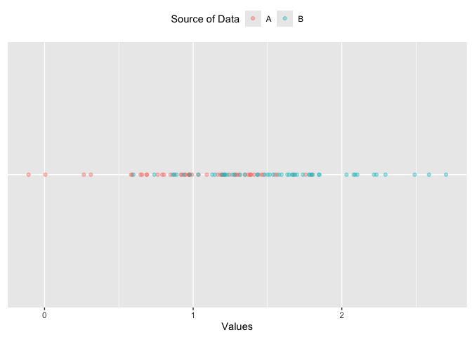
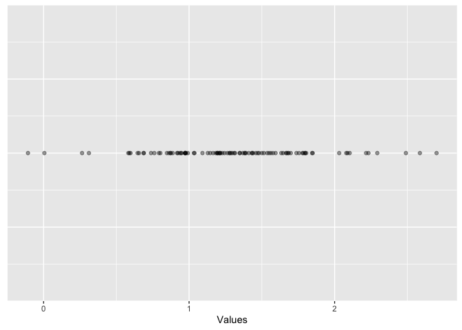
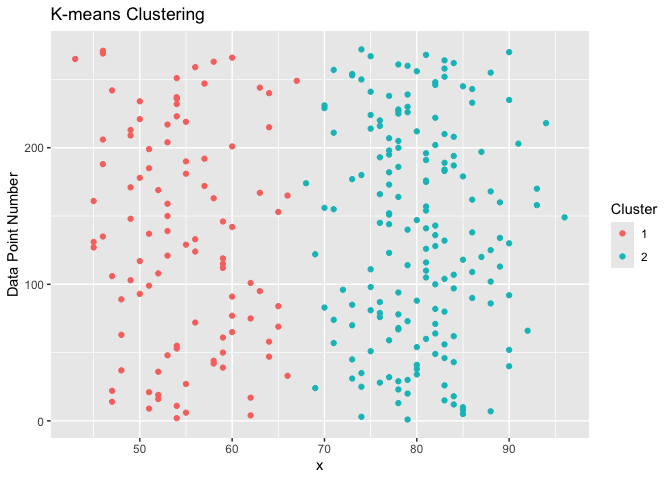
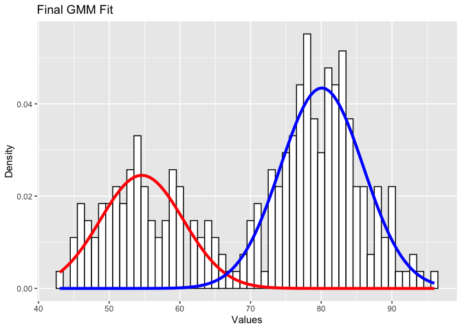

## EMアルゴリズムの実装

``` r
library("ggplot2")
library("dplyr")
library("reshape2")
```

### 完全データの場合のパラメータ推定

次の1次元データが与えられ、「混合された分布のうち、そのデータの元になった確率分布を特定する」という問題を考える。

``` r
options(scipen = 999)
set.seed(1)

comp1.vals <- tibble(comp = "A", vals = rnorm(50, mean = 1, sd = 0.5)) # 平均1, 標準偏差0.5の正規分布から50個のデータを生成
comp2.vals <- tibble(comp = "B", vals = rnorm(50, mean = 1.5, sd = 0.5)) # 平均1.5, 標準偏差0.5の正規分布から50個のデータを生成

# データフレームを結合
vals.df <- bind_rows(comp1.vals, comp2.vals)

# データの可視化
vals.df %>%
  ggplot(aes(x = vals, y = "A", color = factor(comp))) +
  geom_point(alpha = 0.4) +
  scale_color_discrete(name = "Source of Data") +
  xlab("Values") +
  theme(axis.ticks.y = element_blank(),
        axis.text.y = element_blank(),
        axis.title.y = element_blank(),
        legend.position = "top")
```



データソースが2つの正規分布である可能性が高いと信じているとする。この時、最尤推定によってそれぞれの正規分布の平均と標準偏差を推定することができる。最尤推定量は以下のように求められる。

$$
\hat{\mu}\_k = \frac{\sum\_{i=1}^{n_k} x\_{i,k}}{n_k}, \quad \hat{\sigma}\_k^2 = \frac{\sum\_{i=1}^{n_k} (x\_{i,k} - \hat{\mu}\_k)^2}{n_k}
$$

この最尤推定量を計算する。

``` r
vals.df %>%
  group_by(comp) %>%
  summarise(mean = mean(vals), sd = sd(vals))
```

    ## # A tibble: 2 × 3
    ##   comp   mean    sd
    ##   <chr> <dbl> <dbl>
    ## 1 A      1.05 0.416
    ## 2 B      1.56 0.484

このように、完全デデータが与えられた場合には、最尤推定量は容易に求められる。

## 不完全データの場合のパラメータ推定

不完全データすなわち、データの元になった確率分布がわからない場合を考える。

``` r
vals.df %>%
  ggplot(aes(x = vals, y = 0)) +
  geom_point(alpha = 0.4) +
  xlab("Values") +
  theme(axis.ticks.y = element_blank(),
        axis.text.y = element_blank(),
        axis.title.y = element_blank())
```



データソースを示すラベルがない場合は、先ほどのように最尤推定量を計算することはできない。しかし、何らかの方法でデータソースを示すラベルを推定することができれば、最尤推定量を計算することができる。

これを実現するための方法がEMアルゴリズムである。EMアルゴリズムは、不完全データの場合に最尤推定量を計算するためのアルゴリズムである。

EMアルゴリズムは以下の手順で実行される。 1.
ガウス分布に初期パラメータ推定値を設定する。 2.
どのガウス分布から生成されたかの確率を計算して、データをいずれかのガウス分布に割り当てる(ラベル付する)
3. 2のラベルを正しいものとして、各ガウス分布のパラメータを再推定する。
4. 収束するまで2, 3を繰り返す。

### GMMにEMアルゴリズムを適用する

2つのガウス分布の混合を仮定した時のGMMの数学的な定義は以下の通りである。
*p*(*x*\|*μ*,*σ*,*λ*) = *λ*<sub>1</sub>*N*(*x*\|*μ*<sub>1</sub>,*σ*<sub>1</sub><sup>2</sup>) + *λ*<sub>2</sub>*N*(*x*\|*μ*<sub>2</sub>,*σ*<sub>2</sub><sup>2</sup>)

### パラメータの初期値を設定

初期値の設定には、k-meansが使われることが一般的である。
k-meansでハードラベルを設定すれば、それぞれのラベルを正として、各ガウス分布のパラメータ及び混合割合を推定することができる。

最尤推定法により、以下のように推定できる。
$$
\hat{\mu}\_k = \frac{\sum\_{i=1}^{n_k} x\_{i,k}}{n_k}, \quad \hat{\sigma}\_k^2 = \frac{\sum\_{i=1}^{n_k} (x\_{i,k} - \hat{\mu}\_k)^2}{n_k}, \quad \hat{\lambda}\_k = \frac{n_k}{n}
$$
*n*<sub>*k*</sub>はk番目のガウス分布から生成されたデータの数、*n*は全データの数である。

``` r
# kmeansの実行
wait <- faithful$waiting

wait.kmeans <- kmeans(wait, 2)
wait.kmeans.cluster <- wait.kmeans$cluster

wait.df <- data_frame(x = wait, cluster = wait.kmeans.cluster)
```

    ## Warning: `data_frame()` was deprecated in tibble 1.1.0.
    ## ℹ Please use `tibble()` instead.
    ## This warning is displayed once every 8 hours.
    ## Call `lifecycle::last_lifecycle_warnings()` to see where this warning was
    ## generated.

``` r
wait.df %>%
  mutate(num = row_number()) %>%
  ggplot(aes(y = num, x = x, color = factor(cluster))) +
  geom_point() +
  ylab("Values") +
  ylab("Data Point Number") +
  scale_color_discrete(name = "Cluster") +
  ggtitle("K-means Clustering")
```



クラスタ数2を仮定しているので、k-meansの結果も2つのクラスタに分かれる。
クラスタごとに、分布の最尤推定量を計算する。

``` r
wait.summary.df <- wait.df %>%
  group_by(cluster) %>%
  summarize(mu = mean(x), variance = var(x), std = sd(x), size = n())

wait.summary.df %>%
  select(cluster, mu, variance, std)
```

    ## # A tibble: 2 × 4
    ##   cluster    mu variance   std
    ##     <int> <dbl>    <dbl> <dbl>
    ## 1       1  54.8     34.8  5.90
    ## 2       2  80.3     31.7  5.63

混合割合も以下のように計算できる。

``` r
wait.summary.df <- wait.summary.df %>%
  mutate(alpha = size / sum(size))

wait.summary.df %>%
  select(cluster, size, alpha)
```

    ## # A tibble: 2 × 3
    ##   cluster  size alpha
    ##     <int> <int> <dbl>
    ## 1       1   100 0.368
    ## 2       2   172 0.632

### Eステップ

Eステップでは、各データがどのガウス分布から生成されたかの確率を計算する。
これはベイズの定理を用いて計算できる。
$$
P(x_i \in k_j\|x_i) = \frac{P(x_i\|x_i \in k_j) P(x_i \in k_j)}{P(x_i)}
$$
この式の右辺の各要素は以下のように計算できる。 -
*P*(*x*<sub>*i*</sub>\|*x*<sub>*i*</sub>∈*k*<sub>*j*</sub>) = *f*(*x*<sub>*i*</sub>\|*μ*<sub>*k*<sub>*j*</sub></sub>,*σ*<sub>*k*<sub>*j*</sub></sub><sup>2</sup>)ただし、*f*(*x*<sub>*i*</sub>\|*μ*<sub>*k*<sub>*j*</sub></sub>,*σ*<sub>*k*<sub>*j*</sub></sub><sup>2</sup>)はガウス分布の確率密度関数。 -
*P*(*x*<sub>*i*</sub>∈*k*<sub>*j*</sub>) = *λ*<sub>*k*<sub>*j*</sub></sub> -
$P(x_i) = \sum\_{k=1}^K \lambda_k f(x_i\|\mu_k, \sigma_k^2)$ただし、*f*(*x*<sub>*i*</sub>\|*μ*<sub>*k*</sub>,*σ*<sub>*k*</sub><sup>2</sup>)は各ガウス分布の確率密度関数。

``` r
# component1に属する確率
comp1.prod <- dnorm(x = wait, mean = wait.summary.df$mu[1], sd = wait.summary.df$std[1]) * 
  wait.summary.df$alpha[1]

# component2に属する確率
comp2.prod <- dnorm(x = wait, mean = wait.summary.df$mu[2], sd = wait.summary.df$std[2]) * 
  wait.summary.df$alpha[2]

# 分母
normalizer <- comp1.prod + comp2.prod

comp1.post <- comp1.prod / normalizer
comp2.post <- comp2.prod / normalizer
```

これで、各データがどのガウス分布から生成されたかの確率を計算できた。

### Mステップ

事後確率が計算できたので、Mステップでは、各ガウス分布のパラメータを再推定する。具体的には、*N*<sub>*k*</sub>を事後確率に置き換える。

$$
\mu_k = \frac{\sum\_{i=1}^N x_i P(x_i \in k_j\|x_i)}{\sum\_{i=1}^n P(x_i \in k_j\|x_i)}, \quad \sigma_k^2 = \frac{\sum\_{i=1}^n P(x_i \in k_j\|x_i) (x_i - \mu_k)^2}{\sum\_{i=1}^n P(x_i \in k_j\|x_i)}, \quad \lambda_k = \frac{\sum\_{i=1}^n P(x_i \in k_j\|x_i)}{n}
$$

``` r
comp1.n <- sum(comp1.post)
comp2.n <- sum(comp2.post)

comp1.mu <- 1/comp1.n * sum(comp1.post * wait)
comp2.mu <- 1/comp2.n * sum(comp2.post * wait)

comp1.var <- sum(comp1.post * (wait - comp1.mu)^2) * 1/comp1.n
comp2.var <- sum(comp2.post * (wait - comp2.mu)^2) * 1/comp2.n

comp1.lambda <- comp1.n / length(wait)
comp2.lambda <- comp2.n / length(wait)

comp.params.df <- data.frame(comp = c("comp1", "comp2"),
                             comp.mu = c(comp1.mu, comp2.mu),
                             comp.var = c(comp1.var, comp2.var),
                             comp.lambda = c(comp1.lambda, comp2.lambda),
                             comp.cal = c("self", "self"))
```

### 収束の判定

収束の判定は、対数尤度関数の変化量を見ることで判定できる。

``` r
# Already calculate component responsibilities for each data point from above
sum.of.comps <- comp1.prod + comp2.prod
sum.of.comps.ln <- log(sum.of.comps, base = exp(1))
sum(sum.of.comps.ln)
```

    ## [1] -1034.246

### 実装

``` r
#' Expectation Step of the EM Algorithm
#'
#' Calculate the posterior probabilities (soft labels) that each component
#' has to each data point.
#'
#' @param sd.vector Vector containing the standard deviations of each component
#' @param sd.vector Vector containing the mean of each component
#' @param alpha.vector Vector containing the mixing weights  of each component
#' @return Named list containing the loglik and posterior.df
e_step <- function(x, mu.vector, sd.vector, alpha.vector) {
  comp1.prod <- dnorm(x, mu.vector[1], sd.vector[1]) * alpha.vector[1]
  comp2.prod <- dnorm(x, mu.vector[2], sd.vector[2]) * alpha.vector[2]
  sum.of.comps <- comp1.prod + comp2.prod
  comp1.post <- comp1.prod / sum.of.comps
  comp2.post <- comp2.prod / sum.of.comps

  sum.of.comps.ln <- log(sum.of.comps, base = exp(1))
  sum.of.comps.ln.sum <- sum(sum.of.comps.ln)

  list("loglik" = sum.of.comps.ln.sum,
       "posterior.df" = cbind(comp1.post, comp2.post))
}

#' Maximization Step of the EM Algorithm
#'
#' Update the Component Parameters
#'
#' @param x Input data.
#' @param posterior.df Posterior probability data.frame.
#' @return Named list containing the mean (mu), variance (var), and mixing
#'   weights (alpha) for each component.
m_step <- function(x, posterior.df) {
  comp1.n <- sum(posterior.df[, 1])
  comp2.n <- sum(posterior.df[, 2])

  comp1.mu <- 1/comp1.n * sum(posterior.df[, 1] * x)
  comp2.mu <- 1/comp2.n * sum(posterior.df[, 2] * x)

  comp1.var <- sum(posterior.df[, 1] * (x - comp1.mu)^2) * 1/comp1.n
  comp2.var <- sum(posterior.df[, 2] * (x - comp2.mu)^2) * 1/comp2.n

  comp1.lambda <- comp1.n / length(x)
  comp2.lambda <- comp2.n / length(x)

  list("mu" = c(comp1.mu, comp2.mu),
       "var" = c(comp1.var, comp2.var),
       "alpha" = c(comp1.lambda, comp2.lambda))
}
```

### 実行

``` r
for (i in 1:50) {
  if (i == 1) {
    # Initialization
    e.step <- e_step(wait, wait.summary.df[["mu"]], wait.summary.df[["std"]],
                     wait.summary.df[["alpha"]])
    m.step <- m_step(wait, e.step[["posterior.df"]])
    cur.loglik <- e.step[["loglik"]]
    loglik.vector <- e.step[["loglik"]]
  } else {
    # Repeat E and M steps till convergence
    e.step <- e_step(wait, m.step[["mu"]], sqrt(m.step[["var"]]), 
                     m.step[["alpha"]])
    m.step <- m_step(wait, e.step[["posterior.df"]])
    loglik.vector <- c(loglik.vector, e.step[["loglik"]])

    loglik.diff <- abs((cur.loglik - e.step[["loglik"]]))
    if(loglik.diff < 1e-6) {
      break
    } else {
      cur.loglik <- e.step[["loglik"]]
    }
  }
}
loglik.vector
```

    ##  [1] -1034.246 -1034.047 -1034.020 -1034.010 -1034.005 -1034.003 -1034.002
    ##  [8] -1034.002 -1034.002 -1034.002 -1034.002 -1034.002 -1034.002 -1034.002
    ## [15] -1034.002 -1034.002

### 結果

``` r
m.step
```

    ## $mu
    ## [1] 54.61510 80.09122
    ## 
    ## $var
    ## [1] 34.47368 34.42849
    ## 
    ## $alpha
    ## [1] 0.3608934 0.6391066

### プロット

``` r
#' Plot a Mixture Component
#' 
#' @param x Input ata.
#' @param mu Mean of component.
#' @param sigma Standard of component.
#' @param lam Mixture weight of component.
plot_mix_comps <- function(x, mu, sigma, lam) {
  lam * dnorm(x, mu, sigma)
}

data.frame(x = wait) %>%
  ggplot() +
  geom_histogram(aes(x, ..density..), binwidth = 1, colour = "black", 
                 fill = "white") +
  stat_function(geom = "line", fun = plot_mix_comps,
                args = list(m.step$mu[1], sqrt(m.step$var[1]), 
                           lam = m.step$alpha[1]),
                colour = "red", lwd = 1.5) +
  stat_function(geom = "line", fun = plot_mix_comps,
                args = list(m.step$mu[2], sqrt(m.step$var[2]), 
                           lam = m.step$alpha[2]),
                colour = "blue", lwd = 1.5) +
  ylab("Density") +
  xlab("Values") +
  ggtitle("Final GMM Fit")
```

    ## Warning: The dot-dot notation (`..density..`) was deprecated in ggplot2 3.4.0.
    ## ℹ Please use `after_stat(density)` instead.
    ## This warning is displayed once every 8 hours.
    ## Call `lifecycle::last_lifecycle_warnings()` to see where this warning was
    ## generated.


