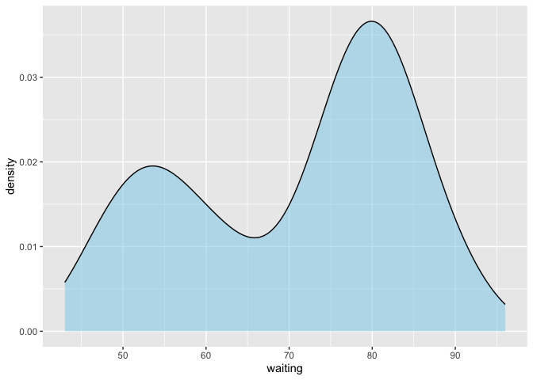
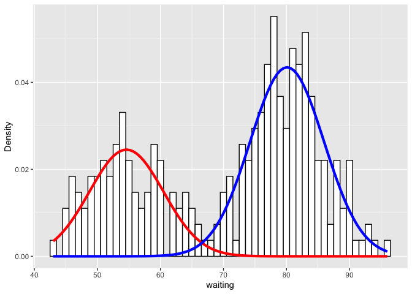

## 混合分布モデルの実装例

``` r
library(ggplot2)
library(tidyverse)
library(mixtools)
```

### データの読み込み

faithfulデータセットを使用する。faithfulデータセットは、Old
Faithful間欠泉の噴出間隔と噴出時間のデータセットである - **eruptions**:
噴出時間 - **waiting**: 噴出間隔

``` r
df <- faithful
df %>% head()
```

    ##   eruptions waiting
    ## 1     3.600      79
    ## 2     1.800      54
    ## 3     3.333      74
    ## 4     2.283      62
    ## 5     4.533      85
    ## 6     2.883      55

waitingの分布を可視化する。

``` r
ggplot(df, aes(x=waiting)) +
  geom_density(fill="skyblue", alpha=0.5)
```



このデータは、2峰性の分布をしていることがわかる。そこで、このデータを2つの正規分布の混合モデルで表現することを考える

### 混合分布モデルの推定

2つの正規分布の確率密度関数を仮定する。

``` r
set.seed(1)
x <- df$waiting
mixmdl <- normalmixEM(x, k=2)
```

    ## number of iterations= 29

### 推定結果の可視化

推定結果を可視化するための関数を定義する。

``` r
#' Plot a Mixture Component
#' 
#' @param x Input data
#' @param mu Mean of component
#' @param sigma Standard deviation of component
#' @param lambda Mixture weight of component(lamnによって、各正規分布を縦方向に伸縮させて調整している)
plot_mix_comps <- function(x, mu, sigma, lambda) {
  lambda * dnorm(x, mu, sigma)
}
```

推定結果を可視化する。

``` r
ggplot(df) +
  geom_histogram(aes(x=waiting, y=after_stat(density)), binwidth = 1, colour = 'black', fill = 'white') +
  stat_function(geom = "line", fun = plot_mix_comps,
                args = list(mixmdl$mu[1], mixmdl$sigma[1], lam = mixmdl$lambda[1]),
                colour = "red", lwd = 1.5) +
  stat_function(geom = "line", fun = plot_mix_comps,
                args = list(mixmdl$mu[2], mixmdl$sigma[2], lam = mixmdl$lambda[2]),
                colour = "blue", lwd = 1.5) +
  ylab("Density")
```



各データが2つの正規分布に属する確率を表示する。

``` r
mixmdl$posterior %>% head()
```

    ##            comp.1       comp.2
    ## [1,] 1.030875e-04 9.998969e-01
    ## [2,] 9.999093e-01 9.066027e-05
    ## [3,] 4.135727e-03 9.958643e-01
    ## [4,] 9.673819e-01 3.261809e-02
    ## [5,] 1.223572e-06 9.999988e-01
    ## [6,] 9.998100e-01 1.899885e-04
