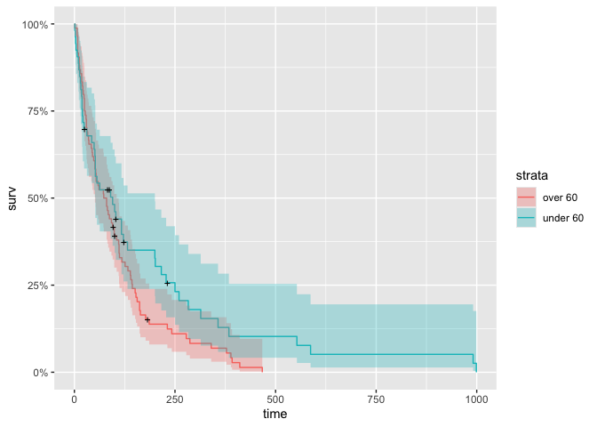

# Survival Analysis

``` r
library(survival)
library(ranger) # for random forest
library(ggplot2)
library(tidyverse)
library(ggfortify) # for plot statistical stuff
library(survminer)
```

## read data

データの説明

-   trt: treatment (1=standard, 2=test)
-   celltype: cell type (1=squamous, 2=smallcell, 3=adeno, 4=large)
-   time: survival time in days
-   status: censoring status (1=censored, 2=dead)
-   karno: Karnofsky performance score (100=good, 0=dead)
-   diagtime: months from diagnosis to randomization
    (診断から無作為割り付けまでの月数)
-   age: in years
-   prior: prior therapy (0=none, 10=had prior therapy)
    (事前治療を受けているか)

``` r
df <- veteran
head(df)
```

    ##   trt celltype time status karno diagtime age prior
    ## 1   1 squamous   72      1    60        7  69     0
    ## 2   1 squamous  411      1    70        5  64    10
    ## 3   1 squamous  228      1    60        3  38     0
    ## 4   1 squamous  126      1    60        9  63    10
    ## 5   1 squamous  118      1    70       11  65    10
    ## 6   1 squamous   10      1    20        5  49     0

## Survオブジェクト

Rで生存分析をするなら、データをSurvオブジェクトに変換する必要がある。Survオブジェクトは生存時間と生存状態を保持するオブジェクトである。第一引数に生存時間、第二引数に生存状態(イベントが発生した個体か、打ち切りか)を指定する。

``` r
# same as Surv(df$time, df$status)
km <- with(df, Surv(time, status))
head(km,80)
```

    ##  [1]  72  411  228  126  118   10   82  110  314  100+  42    8  144   25+  11 
    ## [16]  30  384    4   54   13  123+  97+ 153   59  117   16  151   22   56   21 
    ## [31]  18  139   20   31   52  287   18   51  122   27   54    7   63  392   10 
    ## [46]   8   92   35  117  132   12  162    3   95  177  162  216  553  278   12 
    ## [61] 260  200  156  182+ 143  105  103  250  100  999  112   87+ 231+ 242  991 
    ## [76] 111    1  587  389   33

Survオブジェクトは、生存時間の右側打ち切りを考慮する。数字に”+“がついているものは、右側打ち切りを表す。

## Kaplan-Meier curve

### 全体に対する生存曲線

Kaplan-Meier曲線を描画する。

``` r
km_fit <- survfit(Surv(time, status) ~ 1, data = df)
summary(km_fit, times = c(1, 30, 60, 90*(1:10)))
```

    ## Call: survfit(formula = Surv(time, status) ~ 1, data = df)
    ## 
    ##  time n.risk n.event survival std.err lower 95% CI upper 95% CI
    ##     1    137       2    0.985  0.0102      0.96552       1.0000
    ##    30     97      39    0.700  0.0392      0.62774       0.7816
    ##    60     73      22    0.538  0.0427      0.46070       0.6288
    ##    90     62      10    0.464  0.0428      0.38731       0.5560
    ##   180     27      30    0.222  0.0369      0.16066       0.3079
    ##   270     16       9    0.144  0.0319      0.09338       0.2223
    ##   360     10       6    0.090  0.0265      0.05061       0.1602
    ##   450      5       5    0.045  0.0194      0.01931       0.1049
    ##   540      4       1    0.036  0.0175      0.01389       0.0934
    ##   630      2       2    0.018  0.0126      0.00459       0.0707
    ##   720      2       0    0.018  0.0126      0.00459       0.0707
    ##   810      2       0    0.018  0.0126      0.00459       0.0707
    ##   900      2       0    0.018  0.0126      0.00459       0.0707

``` r
autoplot(km_fit)
```


### treatment groupごとの生存曲線

treatment groupごとの生存率を比較するには、式表現の右辺にtreatment
groupを指定する。
trt=1ならば標準治療、trt=2ならば新治療を受けたということになる。

``` r
km_fit_trt <- survfit(Surv(time, status) ~ trt, data = df)
summary(km_fit_trt, times = c(1, 30, 60, 90*(1:10)))
```

    ## Call: survfit(formula = Surv(time, status) ~ trt, data = df)
    ## 
    ##                 trt=1 
    ##  time n.risk n.event survival std.err lower 95% CI upper 95% CI
    ##     1     69       0   1.0000  0.0000      1.00000        1.000
    ##    30     50      19   0.7241  0.0539      0.62580        0.838
    ##    60     40       9   0.5911  0.0595      0.48526        0.720
    ##    90     37       3   0.5467  0.0603      0.44049        0.679
    ##   180     13      21   0.2124  0.0514      0.13218        0.341
    ##   270      7       5   0.1239  0.0426      0.06318        0.243
    ##   360      4       3   0.0708  0.0336      0.02793        0.180
    ##   450      1       3   0.0177  0.0175      0.00256        0.123
    ##   540      1       0   0.0177  0.0175      0.00256        0.123
    ## 
    ##                 trt=2 
    ##  time n.risk n.event survival std.err lower 95% CI upper 95% CI
    ##     1     68       2   0.9706  0.0205      0.93125        1.000
    ##    30     47      20   0.6765  0.0567      0.57394        0.797
    ##    60     33      13   0.4853  0.0606      0.37993        0.620
    ##    90     25       7   0.3802  0.0591      0.28028        0.516
    ##   180     14       9   0.2329  0.0529      0.14920        0.363
    ##   270      9       4   0.1647  0.0472      0.09389        0.289
    ##   360      6       3   0.1098  0.0407      0.05304        0.227
    ##   450      4       2   0.0732  0.0344      0.02912        0.184
    ##   540      3       1   0.0549  0.0303      0.01861        0.162
    ##   630      2       1   0.0366  0.0251      0.00953        0.140
    ##   720      2       0   0.0366  0.0251      0.00953        0.140
    ##   810      2       0   0.0366  0.0251      0.00953        0.140
    ##   900      2       0   0.0366  0.0251      0.00953        0.140

``` r
autoplot(km_fit_trt)
```


### 年齢ごとの生存曲線

``` r
df <- df %>% mutate(age_group = ifelse(age < 60, "under 60", "over 60"))
```

``` r
km_fit_age <- survfit(Surv(time, status) ~ age_group, data = df)
summary(km_fit_age, times = c(1, 30, 60, 90*(1:10)))
```

    ## Call: survfit(formula = Surv(time, status) ~ age_group, data = df)
    ## 
    ##                 age_group=over 60 
    ##  time n.risk n.event survival std.err lower 95% CI upper 95% CI
    ##     1     84       1   0.9881  0.0118      0.96517       1.0000
    ##    30     61      24   0.7024  0.0499      0.61111       0.8073
    ##    60     45      14   0.5357  0.0544      0.43901       0.6537
    ##    90     37       8   0.4405  0.0542      0.34614       0.5605
    ##   180     12      23   0.1518  0.0400      0.09052       0.2546
    ##   270      8       3   0.1104  0.0355      0.05874       0.2075
    ##   360      5       3   0.0690  0.0292      0.03013       0.1580
    ##   450      1       4   0.0138  0.0137      0.00199       0.0959
    ## 
    ##                 age_group=under 60 
    ##  time n.risk n.event survival std.err lower 95% CI upper 95% CI
    ##     1     53       1   0.9811  0.0187       0.9452        1.000
    ##    30     36      15   0.6981  0.0631       0.5848        0.833
    ##    60     28       8   0.5430  0.0689       0.4234        0.696
    ##    90     25       2   0.5026  0.0694       0.3834        0.659
    ##   180     15       7   0.3505  0.0683       0.2391        0.514
    ##   270      8       6   0.2056  0.0607       0.1152        0.367
    ##   360      5       3   0.1285  0.0518       0.0583        0.283
    ##   450      4       1   0.1028  0.0474       0.0417        0.254
    ##   540      4       0   0.1028  0.0474       0.0417        0.254
    ##   630      2       2   0.0514  0.0349       0.0136        0.195
    ##   720      2       0   0.0514  0.0349       0.0136        0.195
    ##   810      2       0   0.0514  0.0349       0.0136        0.195
    ##   900      2       0   0.0514  0.0349       0.0136        0.195

``` r
autoplot(km_fit_age)
```



## Cox比例ハザードモデル

``` r
# build cox model
cox_model <- coxph(Surv(time, status) ~ trt + celltype + karno + diagtime + age + prior, data = df)
summary(cox_model)
```

    ## Call:
    ## coxph(formula = Surv(time, status) ~ trt + celltype + karno + 
    ##     diagtime + age + prior, data = df)
    ## 
    ##   n= 137, number of events= 128 
    ## 
    ##                         coef  exp(coef)   se(coef)      z Pr(>|z|)    
    ## trt                2.946e-01  1.343e+00  2.075e-01  1.419  0.15577    
    ## celltypesmallcell  8.616e-01  2.367e+00  2.753e-01  3.130  0.00175 ** 
    ## celltypeadeno      1.196e+00  3.307e+00  3.009e-01  3.975 7.05e-05 ***
    ## celltypelarge      4.013e-01  1.494e+00  2.827e-01  1.420  0.15574    
    ## karno             -3.282e-02  9.677e-01  5.508e-03 -5.958 2.55e-09 ***
    ## diagtime           8.132e-05  1.000e+00  9.136e-03  0.009  0.99290    
    ## age               -8.706e-03  9.913e-01  9.300e-03 -0.936  0.34920    
    ## prior              7.159e-03  1.007e+00  2.323e-02  0.308  0.75794    
    ## ---
    ## Signif. codes:  0 '***' 0.001 '**' 0.01 '*' 0.05 '.' 0.1 ' ' 1
    ## 
    ##                   exp(coef) exp(-coef) lower .95 upper .95
    ## trt                  1.3426     0.7448    0.8939    2.0166
    ## celltypesmallcell    2.3669     0.4225    1.3799    4.0597
    ## celltypeadeno        3.3071     0.3024    1.8336    5.9647
    ## celltypelarge        1.4938     0.6695    0.8583    2.5996
    ## karno                0.9677     1.0334    0.9573    0.9782
    ## diagtime             1.0001     0.9999    0.9823    1.0182
    ## age                  0.9913     1.0087    0.9734    1.0096
    ## prior                1.0072     0.9929    0.9624    1.0541
    ## 
    ## Concordance= 0.736  (se = 0.021 )
    ## Likelihood ratio test= 62.1  on 8 df,   p=2e-10
    ## Wald test            = 62.37  on 8 df,   p=2e-10
    ## Score (logrank) test = 66.74  on 8 df,   p=2e-11

### 比例ハザード性の検定

#### log-log plotによる可視化

カプラン・マイヤー推定量を求めた後、plot関数のfun引数に’cloglog’を指定すると、二重対数が表示される。したがってこれが並行かを確認することで、比例ハザード性を検定できる。クロスしているので、比例ハザード性を仮定できないように見える。

``` r
ggsurvplot(km_fit_trt, fun = "cloglog")
```


#### Schoenfeld残差による可視化

Schoenfeld残差を求めるためには、cox.zph関数を使う。karnoは時間と共に変化するため、karnoに対しては比例ハザード性を仮定できないように見える。

``` r
fit_test <- cox.zph(cox_model)

# 3*2のプロット
par(mfrow=c(2,3))
plot(fit_test, var = 1)
plot(fit_test, var = 2)
plot(fit_test, var = 3)
plot(fit_test, var = 4)
plot(fit_test, var = 5)
plot(fit_test, var = 6)
```


#### Schoenfeld残差による適合度検定

Schoenfeld残差と生存時間の間の相関を検定する。帰無仮説は相関係数が0であることである。celltypeおよびkarnoが有意な相関を持っているため、比例ハザード性を仮定できないように見える。

``` r
print(cox.zph(cox_model))
```

    ##            chisq df       p
    ## trt       0.2644  1 0.60712
    ## celltype 15.2274  3 0.00163
    ## karno    12.9352  1 0.00032
    ## diagtime  0.0129  1 0.90961
    ## age       1.8288  1 0.17627
    ## prior     2.1656  1 0.14113
    ## GLOBAL   34.5525  8 3.2e-05

### Cox比例ハザードモデルの可視化

``` r
cox_fit <- survfit(cox_model)
autoplot(cox_fit)
```


